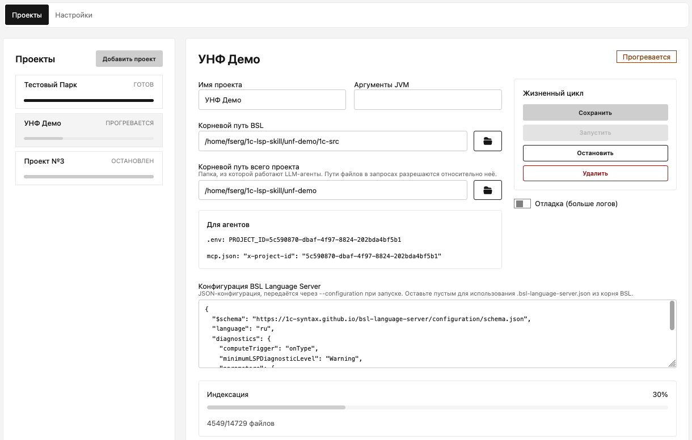
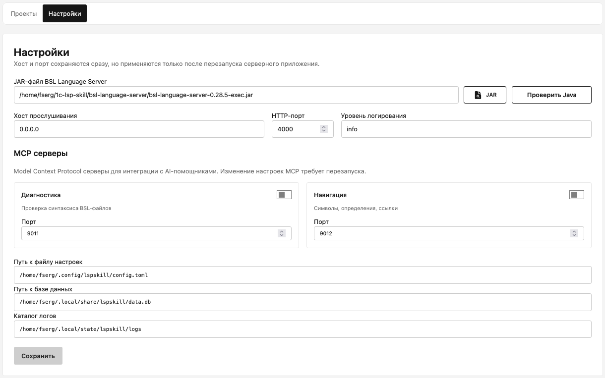
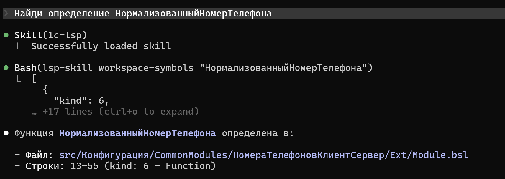
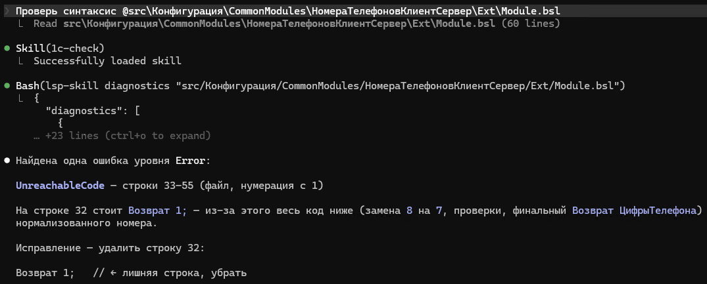

# 1с-lsp-mcp-skill

Кросплатформенное приложение - менеджер запуска и MCP-bridge для нескольких инстансов [bsl-language-server](https://github.com/1c-syntax/bsl-language-server) под разные 1С-проекты.

Поддерживается работа как через MCP, так и через SKILLs. 
Не требуется docker или каких-то зависимости, кроме JVM для запуска самого bsl-language-server.

Проект состоит из:
- `lsp-skill-server`  консольный HTTP сервер с web UI для управления
- `lsp-skill` — CLI для запросов к уже созданному проекту

# Что умеет

- Запускать несколько инстансов `bsl-language-server` (свой на каждый 1С-проект) c прогрессом индексации (наполнения контекста)
- Проверка синтаксиса: `diagnostics` через MCP или SKILLs CLI
- Передавать `bsl-language-server` изменения в кодовой базе 1С-проекта (эффективная push-модель)
- Навигация по кодовой базе: `symbols`, `references`, `definition`, `workspace-symbols`, `incoming-calls`, `outgoing-calls` через MCP или SKILLs CLI
- Call Hierarchy: отвечать на вопросы "Кто вызывает эту процедуру?" и "Что вызывает эта процедура?"
- Каждый инстанс `bsl-language-server` можно запускать со своими jvm ключами (для больших 1С-проектов нужно выделять больше RAM)
- Каждый инстанс `bsl-language-server` можно запускать со своим [конфигурационным файлом](https://1c-syntax.github.io/bsl-language-server/features/ConfigurationFile/) (например, с разными исключениями для диагностик)
- Работать как служба в фоне (опционально)

## Ближайшие планы
- Уменьшить вербозность (многословность) ответов bsl-language-server

## Комплект поставки в релизе
- Два готовых бинарника `lsp-skill-server` и `lsp-skill` для соответствующих платформ (Windows, Linux, MacOS arm и x64)
- Два скила (с аналогичными двумя MCP):
       - `1c-check` - для проверки синтаксиса
       - `1c-lsp` - для навигации по коду (поиск символов, определений, ссылок)
- Пример файла `mcp.json` для настройки MCP-клиентов (IDE)
- Примеры файлов `AGENTS.md` для усилиния уверенности вызовов MCP или SKILLs LLM-агентами. Это не обязательно, но с некоторыми модельками помогает.

## [Быстрый старт](quickstart.md)

## Лицензия

Проект распространяется под лицензией `LGPL-3.0`.

Файлы лицензии в репозитории:
- `LICENSE` — GNU Lesser General Public License v3.0
- `COPYING` — GNU General Public License v3.0
